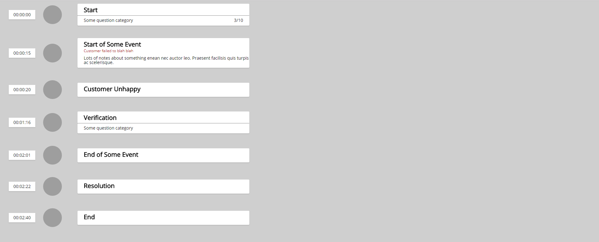

# Interactions Timeline Component
> 2 hour frontend development test

Personal attempt at creating a React component version of the
[Topbox Interaction Interview test](https://github.com/topbox-rci/Interaction-Interview-Test).
The work done here shows my rough draft of what I would prioritize and do in 2 hours.
This project skips steps to improve the build process and skips testing. The project was scaffolded using
[create-react-app](https://github.com/facebook/create-react-app).

# To Run
Run the following command
```
npm start
```

